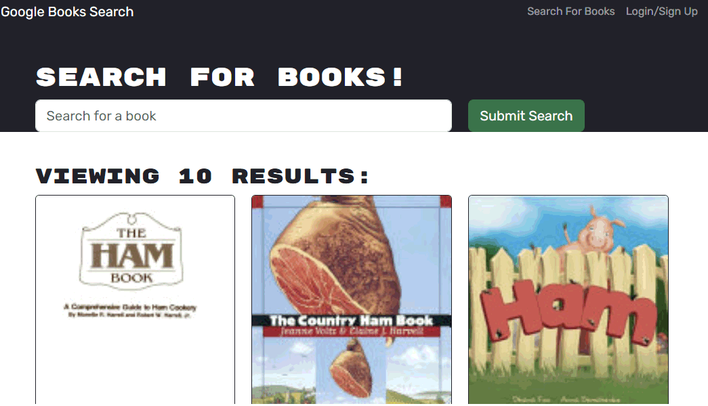
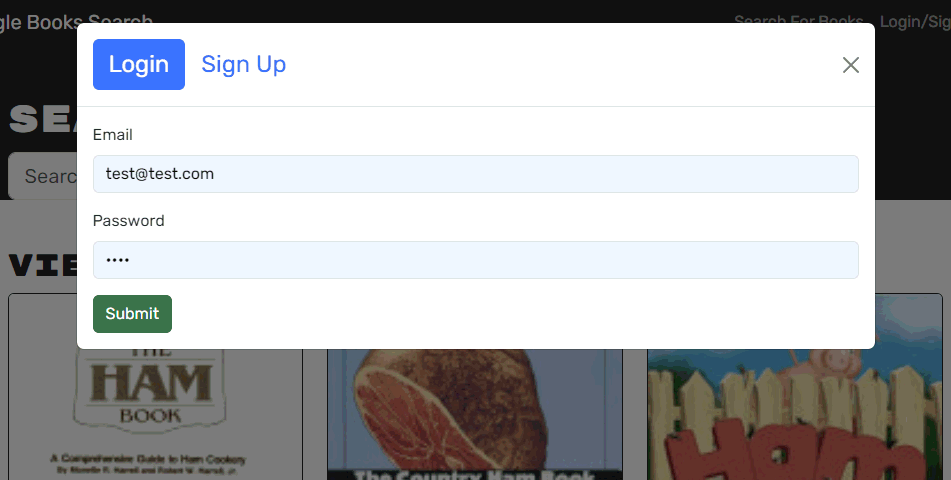
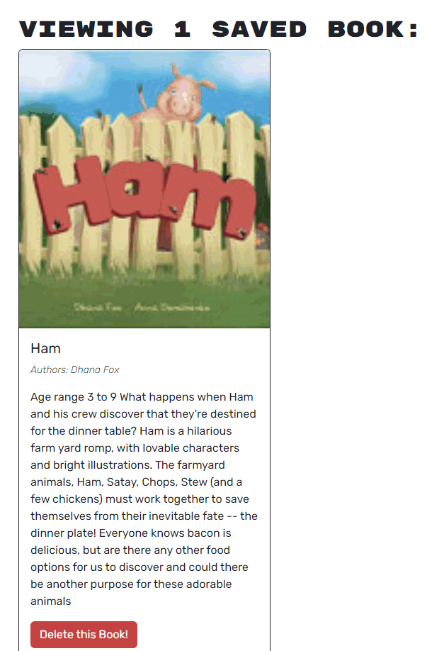

# Google Book Collector
## Save books to your Google Books library

### Description

This is a MongoDB, Express, React, Node.js (MERN) application that allows users to search for books using the Google Books API and save them to their own collection, stored locally and on server.
Users can log in to save, view, and modify their book collection.

### Screenshots

### Installation

Clone the repository code locally, then navigate to the root folder of the application.
To install dependencies, run the following:

`
npm i
`

To start the application, run the following:

`
npm start
`

To run a live development server, run the following:

`
npm run develop
`

### Usage

This application is deployed on Heroku at https://google-book-collector.herokuapp.com/.

### License

This repository is licensed under the MIT: (https://opensource.org/licenses/MIT) license.

### Questions

Questions about this repository? Please contact me at [https://stanj.link]

